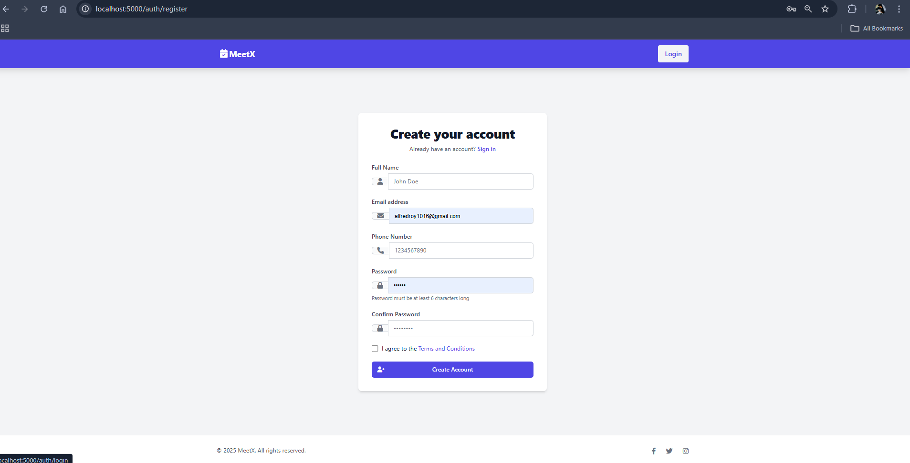
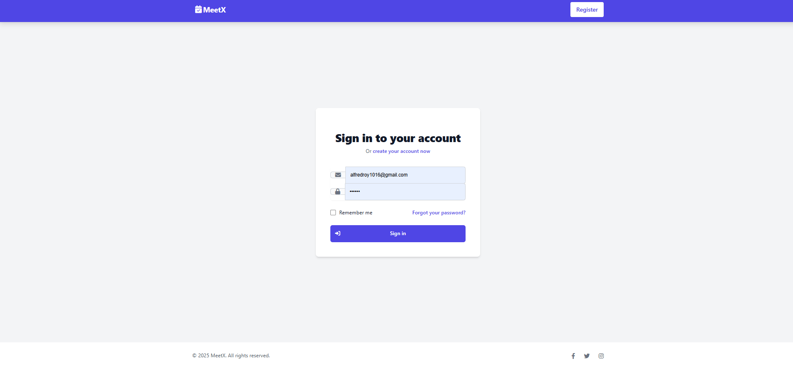
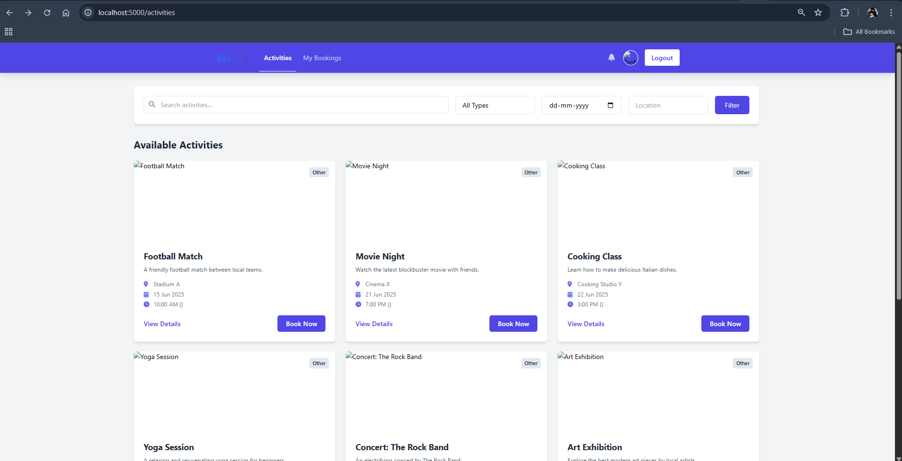
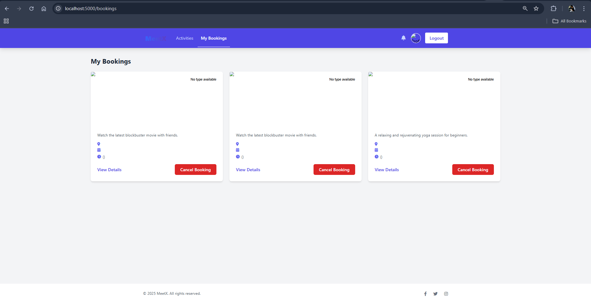

MeetX Activity Booking App

A simple web app for activity booking developed using Node.js, Express.js, MongoDB, JWT, and EJS.

 Features
User Authentication: Register and login with JWT.

Protected Routes: Access booking features only when logged in.

Activity Listing: View available activities with details.

Book & View Bookings: Book activities and view your bookings.

 Technologies
express, mongoose, ejs, bcryptjs, jsonwebtoken, dotenv, cookie-parser

Screenshots
Register page

Login Page

Activity Listing

Bookings Overview
